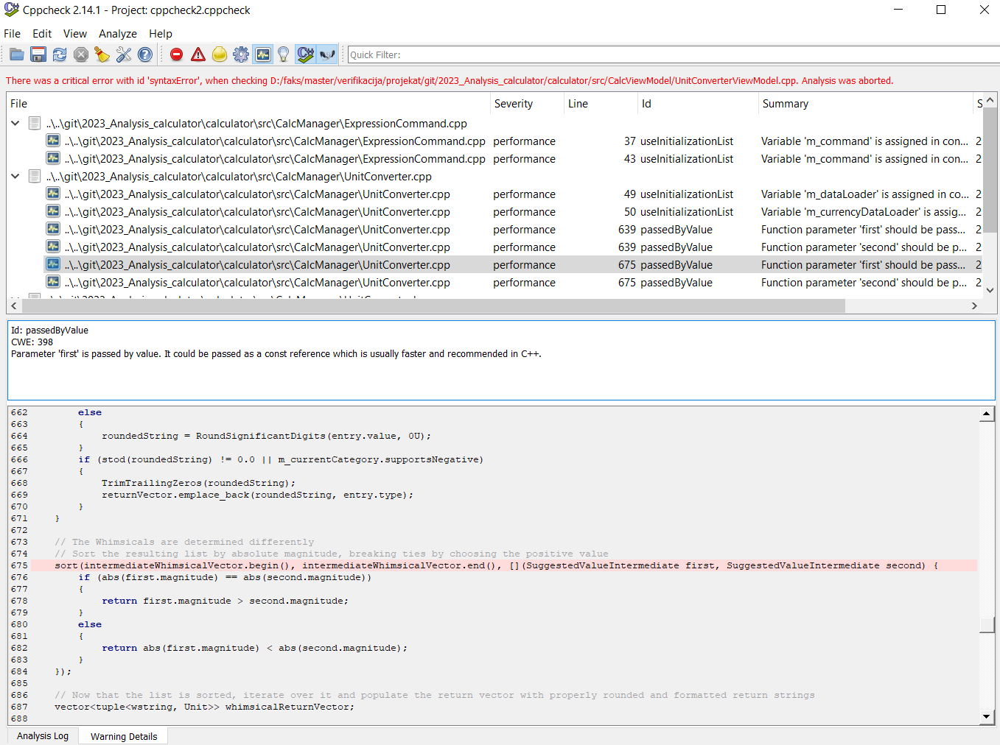
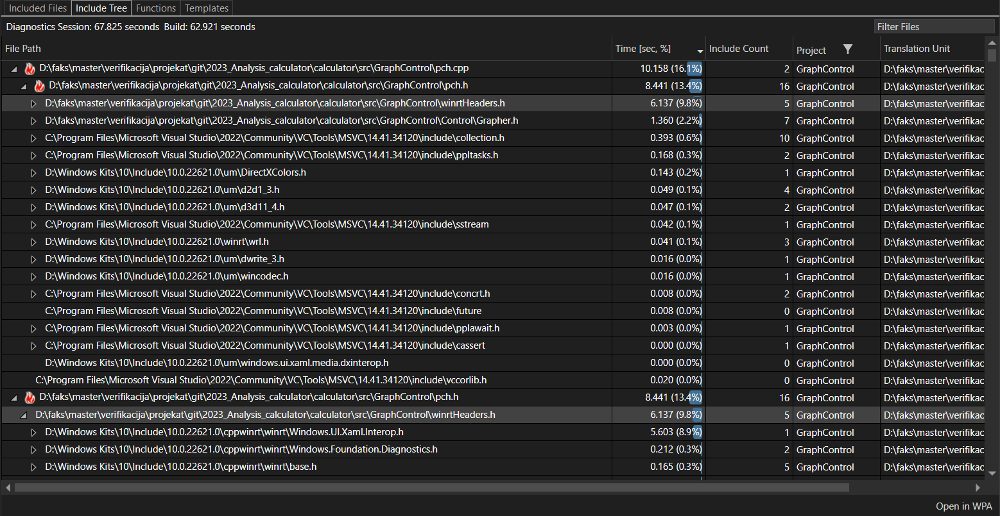
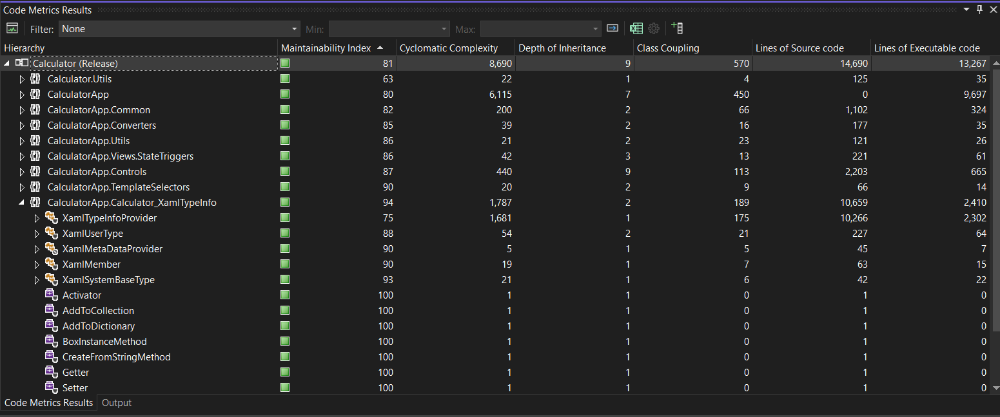

# CppCheck
Cppcheck je statički analizator koda za C i C++ projekte koji omogućava identifikaciju potencijalnih grešaka, propusta i poboljšanja u kodu pre nego što se oni manifestuju tokom izvršavanja aplikacije. Ovaj alat je veoma koristan za povećanje kvaliteta koda i osiguravanje poštovanja najboljih programskih praksi, što je posebno važno u velikim projektima.

Proces integracije Cppcheck-a u ovaj projekat uključuje kloniranje alata kao git submodula unutar posebnog direktorijuma cppcheck. Nakon toga, projekat se build-uje pomoću alata CMake kroz priloženu skriptu. Analiza celog Visual Studio rešenja se pokreće pomoću navođenja putanje do .sln fajla sa --project opcijom. Rezultati izvršavanja se čuvaju u report.xml fajlu.

Alat takođe poseduje i GUI verziju, koja je laka za korišćenje i u kojoj su rezultati pregledniji. 

Gledajući rezultate analize može se zaključiti da je kod jako dobro napisan, greške koje prijavljuje CppCheck su uglavnom iz specifične sintakse u .NET C++ projektima. ali pošto je codebase ogroman naravno da postoji par mesta gde je moguće poboljšanje, kao na primer prosleđivanje parametara funkcijama kao const reference umesto preko vrednosti.

# Dr Memory
Dr. Memory je alat za dinamičku analizu memorije, dizajniran da detektuje probleme sa upravljanjem memorijom u aplikacijama napisanima u C i C++. Ovaj alat je posebno koristan za otkrivanje teško uočljivih grešaka poput curenja memorije, upotrebe neinicijalizovane memorije, prekoračenja međuspremnika i drugih sličnih problema koji mogu izazvati nestabilnost aplikacije ili sigurnosne ranjivosti.

Proces korišćenja Dr. Memory uključuje instalaciju alata [Dr Memory](https://drmemory.org/page_download.html), a potom postavljanje pravilnih putanja u skripti koja pokreće alat. Pre pokretanja skripte je neophodno build-ati rešenje u Debug modu.  Pokretanjem skripte drmemory.bat, izvršava se aplikacija CalculatorApp.exe i generišu se izveštaji u posebnom direktorijumu drmemory_report. Svaki put kada se pokrene skripta, generisaće se novi folder za izlaz, u formatu "DrMemory-\<appname>.\<pid>.NNN". Unutar njega se nalazi results.txt koji sadrži rezultat.

Analiza Dr. Memory-a pokazuje da nema kritičnih grešaka u upravljanju memorijom. Nije detektovano nepristupačnih memorijskih lokacija, nevalidnih argumenata za heap, GDI grešaka, curenja hendla, niti curenja memorije. Međutim, identifikovane su dve jedinstvene greške povezane sa čitanjem neinicijalizovane memorije, sa ukupno pet pojavljivanja. Iako ove greške mogu dovesti do nepredvidivog ponašanja aplikacije, njihova učestalost je niska, što ukazuje na relativno dobar kvalitet koda s obzirom na veličinu aplikacije.

# Build Insight
Build Insights je alat u okviru Visual Studija dizajnirana za detaljnu analizu i optimizaciju procesa buildovanja u C++ projektima. Pomaže u identifikuji tačke usporenja, prekomerne zavisnosti, i druge faktore koji mogu produžiti vreme kompilacije. Build Insights omogućava vizuelizaciju različitih aspekata build procesa, kao što su vreme kompilacije za pojedinačne fajlove, učestalost ponovnog buildovanja i efekti različitih optimizacija.

Da bi se koristio u Visual Studiu, nakon selektovanja rešenja izabrati opciju: "Run Build Insight on Build Solution". Rešenje će se build-ovati, i otvoriće se Event Trace Log (ETL) fajl. 

U "Included Files" prozoru, može se videti vreme potrebno za obradu header fajlova. "Parse count" kolona pokazuje koliko puta je neki header fajl bio uključen u druge fajlove. Ako je ovaj broj veći, taj header može biti dobar kandidat za pre-kompajovanje. 

Gledajući zavisnosti i vreme za kompilaciju, može se doći do zaključka da će ukljucivanje "\src\GraphControl\winrtHeaders.h" header-a u prekompilaciju doneti bolje performanse. 

Klikom na opciju "Open in WPA" otvara se prozor u kome se mogu videti informacije o build trace-u u obliku grafikona. U  folderu "Build Insight WPA" se nalazi jedan takav trace fajl.

# Code Metrics
Code Metrics je interni alat u Visual Studiu koji poseduje skup mera softvera kako bi programerima pružio bolju sliku o kodu. Korišćenjem ovog alata može da pruži uvid u to koji delovi bi trebalo da se preprave i kakvo je celokupno stanje projekta.

Code Metrics pruža nekoliko mera softvera:
- Maintainability Index - Vrednost od 0 do 100 koja pokazuje oslikava lakoću održavanja koda. Veća vrednost je bolja. 
- Cyclomatic Complexity - Mera strukturne kompleksnosti koda. Računa se pomoću broja različitih putanja kroz kod. Kod koji ima kompleksnije putanje je teži za održavanje.
- Depth of Inheritance - Broj različitih klasa koje nasleđuju jedna od druge, sve do bazne klase. Što je ovaj broj veći, to je veća dubina zavisnosti i veća šansa da će se neka bazna klasa promeniti, što može dovesti do problema. Poželjan je što manji broj.
- Class Coupling - Mera kopčanja klasa kroz parametre, promenljive, pozive metoda, implementacije interfejsa... Velika vrednost sugeriše da je kod teži za reciklažu, zbog velike povezanosti sa ostalim delovima koda.
-Lines of Source code - Broj linija source fajla
Lines of Executable code - Približan broj pokretljivih linija koda.

U folderu "Code Metrics" se nalazi izveštaj o metrikama za Calculator (Release) projekat. Može se zaključiti da je kod veoma održiv sa ukupnom ocenom 81. Sem za par fajlova, metrike su dobre sobzirom na broj linija koda, kojih ukupno ima 13267.

# Test Coverage
Koriste se .NET alati, dotnet test i dotnet-coverage, da bi se pokrenuo već postojeći projekat za UnitTestove i prikupila metrika pokrivenoti. Pokretanjem skripte se metrika prvo prikuplja a zatim se generiše čitljiviji izveštaj korišćenjem reportgenerator alata.

Zbog problema sa build-ovanjem CalculatorUnitTests projekta, skripta daje loš rezultat, pa ga ne mogu tumačiti.
